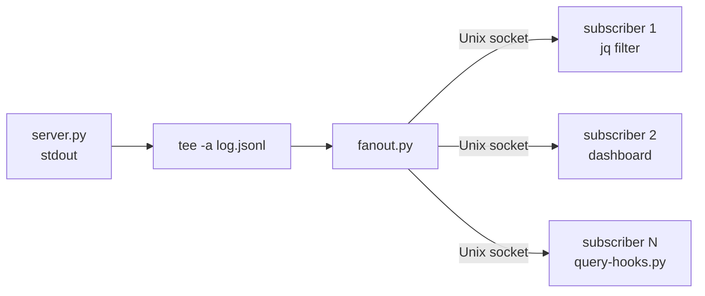

# JSONL Fan-Out Daemon

ZeroMQ-inspired PUB/SUB for JSONL streams over Unix sockets.

Reads JSONL lines from stdin and fans them out to all connected subscribers.
Subscribers connect/disconnect freely — slow or dead subscribers are dropped
immediately (no buffering), matching ZeroMQ PUB socket semantics.

## Architecture



## Quick Start

```bash
# Terminal 1: Start fan-out with an observatory server
./tcp-observatory/server.py | tee -a /tmp/claude/observatory/tcp.log | ./jsonl-fanout/fanout.py

# Terminal 2: Subscribe and filter
./jsonl-fanout/subscribe.py | jq 'select(._event == "PreToolUse")'

# Terminal 3: Subscribe and watch tool names
./jsonl-fanout/subscribe.py | jq -r '.tool_name // empty'

# Terminal 4: Raw subscribe with socat (no Python needed)
socat - UNIX-CONNECT:/tmp/claude-fanout.sock
```

## CLI Reference

### fanout.py

```
fanout.py [--socket PATH] [--mode OCTAL] [--stats]

Options:
  --socket PATH    Unix socket path (default: $CLAUDE_FANOUT_SOCKET or /tmp/claude-fanout.sock)
  --mode OCTAL     Socket file permissions (default: 0660)
  --stats          Print periodic subscriber stats to stderr
```

### subscribe.py

```
subscribe.py [--socket PATH]

Options:
  --socket PATH    Unix socket path (default: $CLAUDE_FANOUT_SOCKET or /tmp/claude-fanout.sock)
```

## Composition Examples

### With TCP Observatory

```bash
./tcp-observatory/server.py | tee -a tcp.log | ./jsonl-fanout/fanout.py
```

### With Unix Socket Observatory

```bash
./unix-socket-observatory/server.py --tee --output-socket /tmp/obs-out.sock &
socat UNIX-CONNECT:/tmp/obs-out.sock - | ./jsonl-fanout/fanout.py
```

### With Rust Observatory

```bash
./rust-observatory/target/release/observatory | tee -a rust.log | ./jsonl-fanout/fanout.py
```

### Custom Socket Path via Environment

```bash
export CLAUDE_FANOUT_SOCKET=/run/user/$(id -u)/claude-fanout.sock
./jsonl-fanout/fanout.py  # uses $CLAUDE_FANOUT_SOCKET
./jsonl-fanout/subscribe.py  # same
```

## Why This Design? The Lego Blocks Philosophy

This daemon follows the same philosophy as ZeroMQ: build small, composable pieces
that snap together like construction toys. Rather than embedding fan-out into each
observatory server, we make a standalone tool that any server can pipe into.

> "Make building blocks that people can understand and use *easily*, and people
> will work together to solve the very largest problems."
> — [The ZeroMQ Guide, Chapter 1](https://zguide.zeromq.org/docs/chapter1/)

ZeroMQ provides four fundamental socket patterns (request-reply, pub-sub, pipeline,
exclusive pair) as building blocks. We borrow one — PUB/SUB — and implement it with
Unix pipes and sockets. Start simple (just `tee` to a log file), then snap on
fan-out when you need multiple consumers.

For the full "sockets as building blocks" concept, see
[Chapter 2: Sockets and Patterns](https://zguide.zeromq.org/docs/chapter2/) in the
ZeroMQ Guide.

## Learning Path

This tool fits into the repo's progressive learning curve:

1. **Start simple** — `./tcp-observatory/server.py` pipes JSONL to stdout, `tee` saves to a file
2. **Add filtering** — pipe through `jq` or `query-hooks.py` for ad-hoc analysis
3. **Add fan-out** — pipe into `fanout.py` when you need multiple concurrent consumers
4. **Build on top** — write your own subscriber that does alerting, dashboards, or metrics

Each step adds one concept without changing the previous ones. That's the point.

## Design Decisions

| Decision | Choice | Why |
|----------|--------|-----|
| Input | stdin only | Pipe composition; no protocol needed |
| Transport | Unix socket | No port conflicts, filesystem permissions |
| Backpressure | Drop slow subscribers | ZeroMQ PUB semantics; simplest correct behavior |
| Event loop | selectors | Single-threaded, no locks, matches repo patterns |
| Protocol | Raw JSONL stream | No handshake, no framing — connect and receive |

## Testing

```bash
uv run --script jsonl-fanout/test_fanout.py -v
```

## How It Works

The daemon uses Python's `selectors` module to monitor two file descriptors in a single thread:

1. **stdin** (non-blocking) — incoming JSONL lines
2. **listener socket** — new subscriber connections

When a complete line arrives on stdin, `fan_out()` attempts `sendall()` to each subscriber. Any subscriber that raises `BrokenPipeError` or `OSError` is immediately disconnected — no retry, no buffering. This matches ZeroMQ's PUB socket behavior where slow consumers are dropped rather than causing backpressure on the publisher.

**Non-blocking stdin subtlety:** `os.read()` on a non-blocking fd returns whatever bytes are available — not necessarily a complete line. The daemon accumulates bytes in a buffer and splits on `\n` to extract complete lines. This is a common pattern when combining non-blocking I/O with line-oriented protocols.
